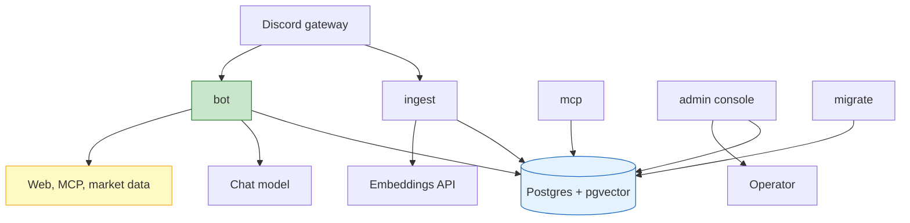
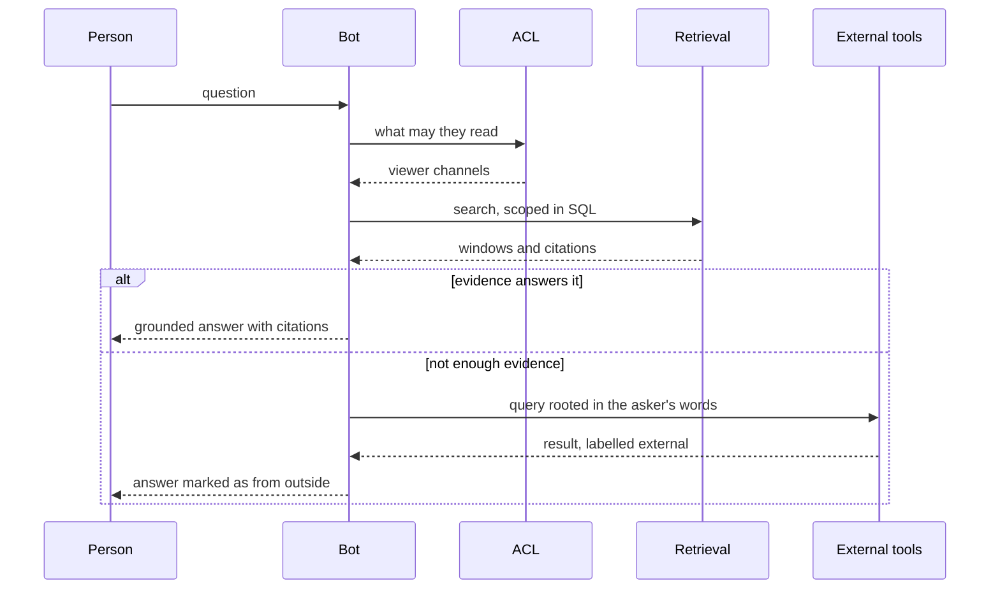

# CyberFriend

An ACL-aware chat-memory agent for Discord. It indexes channel history into
Postgres with pgvector and answers questions about it — *what did people ask me
today*, *what was decided about the deploy* — filtered to the channels the
person asking is actually permitted to read.

When your own conversations do not hold the answer, it can look outside: the
web, a federated MCP server, or live market data. Anything from outside is
labelled as such, so you can always tell what a colleague said from what the
internet said.

## What it does

| | |
|---|---|
| **Answers from your channels** | Hybrid lexical and vector retrieval over conversation windows, scoped to what you may read, with citations that link back to the message |
| **Audience-aware answers** | In a channel it only cites what everyone there can read; ask in a DM for your full view |
| **Obligations** | Extracts what people asked of each other. `what do I need to do?`, closed with a ✅ reaction or `/resolve` |
| **Conversation memory** | Follow-ups keep context, per person and per place, and stop being recalled if you lose access to a channel behind them |
| **Personal facts** | *call me Leo*, *my email is …*, *reply in Portuguese*. Your email is only ever shown in a DM to you |
| **Documents** | Attachments and linked documents, parsed in a sandboxed child process |
| **Web and MCP** | Wikipedia, Google via SerpApi, and any MCP server an operator allowlists |
| **Market data** | BTC and ETH, the S&P 500, and currency conversion, each stated with how current it is |
| **Index from chat** | `/index #channel` for anyone with Manage Channels there, applied without a redeploy |
| **Admin console** | A web console for federation, channels, retention, opt-outs and tokens |
| **MCP interface** | Your corpus as an MCP server, under the same permission rules |
| **Tracing** | Each run — question, answer and the evidence behind it — exported to Langfuse for study. Off by default |

## The rules it keeps

These are the invariants the whole design is arranged around. They are specified
in `openspec/` and tested, not left to a prompt.

- **Retrieval is scoped in SQL, never filtered afterwards.** The viewer is a
  required argument; a permission predicate that runs after ranking silently
  under-returns for whoever is in fewest channels.
- **Retrieved content is data, never instruction.** Messages, documents, tool
  results, remembered turns and nicknames are fenced with an unpredictable
  delimiter and neutralised.
- **Answers are grounded.** Every claim traces to retrieved evidence; the
  assistant says it found nothing rather than answering from the model's own
  knowledge. Memory interprets a follow-up but never becomes a source.
- **Deleted content disappears everywhere, immediately.**
- **What leaves is only what you typed.** An outbound query must be rooted in
  the asker's own words, so retrieved content cannot become a search term.
- **State-changing tools need a person's approval**, with the exact arguments
  shown.

## Architecture

Three long-running processes over one database, plus a one-shot migration and
the console.



| Process | Role | Public |
|---|---|---|
| `migrate` | Applies migrations once per deploy, then exits | no |
| `ingest` | Capture, backfill, windowing, embeddings, ask extraction, retention | no |
| `bot` | Answers questions in Discord | no |
| `mcp` | MCP interface to the corpus | yes |
| `admin` | Operator console and its API | yes |

`ingest` runs exactly one replica. Two containers on one bot token both identify
to the gateway and ingest every message twice; Discord does not complain, the
corpus just silently doubles.

### How a question is answered



The code follows the same shape: `domain/` holds the vocabulary, `app/` the
rules, `adapters/` everything that talks to Discord, Postgres, models and the
web, and `entrypoints/` wires each process together. `composition.py` is the one
place that knows how the parts fit.

## Running it locally

You need Docker, Python 3.11+, [uv](https://docs.astral.sh/uv/),
[just](https://just.systems) and Node (for the console).

```bash
just install          # virtualenv, dependencies, console packages
cp .env.example .env  # fill in DISCORD_TOKEN, DISCORD_GUILD_ID, LLM_API_KEY
just up               # Postgres with pgvector
just migrate
just run-ingest       # in one terminal
just run-bot          # in another
```

Setting up the Discord side — application, token, intents, invite, and the
server and channel IDs — is walked through in
[docs/discord-setup.md](docs/discord-setup.md). Two privileged intents are
required:

- **MESSAGE CONTENT**, to read what people actually said. Without it every
  message arrives empty.
- **SERVER MEMBERS**, to work out who can read a channel. Without it the bot
  fails closed: audiences resolve empty and public answers cite nothing.

`INDEXED_CHANNEL_IDS` is empty by default and indexes nothing, because an
archive is a decision rather than a default.

### Everyday commands

`just` on its own lists them all.

| | |
|---|---|
| `just check` | Everything CI runs: lint, types, tests, specs |
| `just test` | Unit and integration, migrating first |
| `just test-unit` | No database, a few seconds |
| `just t tests/unit/test_memory.py -k recall` | One file or one test |
| `just goldens` | Retrieval quality measurement (spends embedding calls) |
| `just db-reset` | Back to a clean database |
| `just build` | The production image, as the platform builds it |
| `just admin-token leonardo` | A console credential for one operator |

## Tests

```bash
just check
```

Integration tests need the live pgvector database and skip when none is
reachable, so a missing database is never reported as a defect in the code. The
retrieval golden set is opted into separately because it spends embedding
calls; see [tests/evaluation/BASELINE.md](tests/evaluation/BASELINE.md) for the
recorded baseline and how to read it.

## Deployment

Runs on Coolify as a `dockercompose` resource against a managed **PostgreSQL
with pgvector** database; the stock `postgres` image does not carry the
extension. [docs/deploy-coolify.md](docs/deploy-coolify.md) has the full
runbook, including three settings that have each broken this deployment once:

- **Connect To Predefined Network** must be on, or nothing reaches the database.
- **Every setting must appear in `docker-compose.yml`**, or the platform refuses
  it and the operator silently gets the default.
- **`CHAT_MODEL_CAPABILITIES` narrows** what the model is assumed to support, so
  omitting one turns it off.

Do not trust a green status on its own. To confirm the bot really reconnected
after a deploy, check that Discord's IDENTIFY count dropped:

```bash
curl -s -H "Authorization: Bot $DISCORD_TOKEN" \
  https://discord.com/api/v10/gateway/bot | jq .session_start_limit.remaining
```

## Configuration

Settings are environment variables, read at startup; indexing scope is also
read live from the database so it can change without a redeploy. `.env.example`
lists the common ones. The settings worth knowing:

| | |
|---|---|
| `INDEXED_CHANNEL_IDS` | What is archived. Empty means nothing |
| `CHAT_MODEL`, `EXTRACTION_MODEL` | Answering and the cheap background work |
| `CHAT_MODEL_CAPABILITIES` | What the endpoint supports; narrowing is deliberate |
| `WEB_TOOLS_ENABLED`, `SERPAPI_KEY` | Wikipedia and Google. Off by default |
| `MARKET_TOOLS_ENABLED` | BTC, ETH, S&P 500, currency conversion. Off by default |
| `FEDERATION_SERVERS`, `FEDERATION_TOOL_ALLOWLIST` | MCP servers and the tools allowed from them |
| `MEMORY_RETENTION_DAYS` | How long conversation memory is kept |
| `ASK_EXTRACTION_ENABLED` | Whether obligations are extracted |
| `TRACING_ENABLED`, `LANGFUSE_HOST` | Export runs for study. Off by default |
| `LANGFUSE_PUBLIC_KEY`, `LANGFUSE_SECRET_KEY` | Credentials for that destination |

Anything that reaches outside the server is off by default. A deployment should
acquire an outbound boundary because somebody chose it.

## Working on it

This project is spec-driven. Read `openspec/changes/*/proposal.md` before
changing behaviour, and `design.md` for why things are shaped as they are.

```bash
just specs            # active changes and their progress
just spec             # validate every spec strictly
```

Further reading:

- [docs/discord-setup.md](docs/discord-setup.md) — preparing Discord
- [docs/deploy-coolify.md](docs/deploy-coolify.md) — deployment runbook
- [docs/admin-console.md](docs/admin-console.md) — the operator console
- [docs/operations.md](docs/operations.md) — running it day to day
- [docs/mcp-interface.md](docs/mcp-interface.md) — the MCP interface
- [docs/document-ingestion.md](docs/document-ingestion.md) — attachments and links

## Two things to know before running this anywhere real

**It creates a permanent searchable archive of everything said in indexed
channels.** That needs a retention window, disclosure to the team, and an
opt-out. All three exist; the policy is a decision, not a default.

**Tracing copies retrieved content into a store with no permission rules.**
With `TRACING_ENABLED` on, each run's question, answer and evidence are sent to
Langfuse, which has no notion of who may read a channel. Anyone with access to
it can read everything the assistant has retrieved, from every channel. Deleting
a message does follow — the tombstone deletes the traces quoting it, and a
failed deletion is retried — but the destination still has to be protected the
way the database is. It is off by default for this reason.

**No bot can read direct messages between people, on any platform.** Questions
like "what did people ask me today" cover indexed channels and DMs sent to the
bot, and nothing else.
